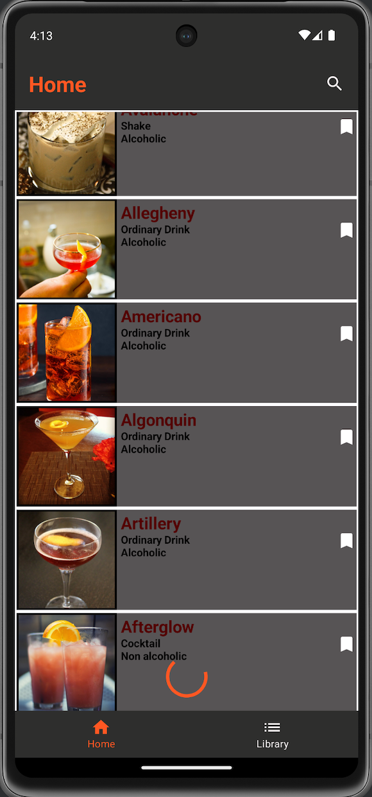
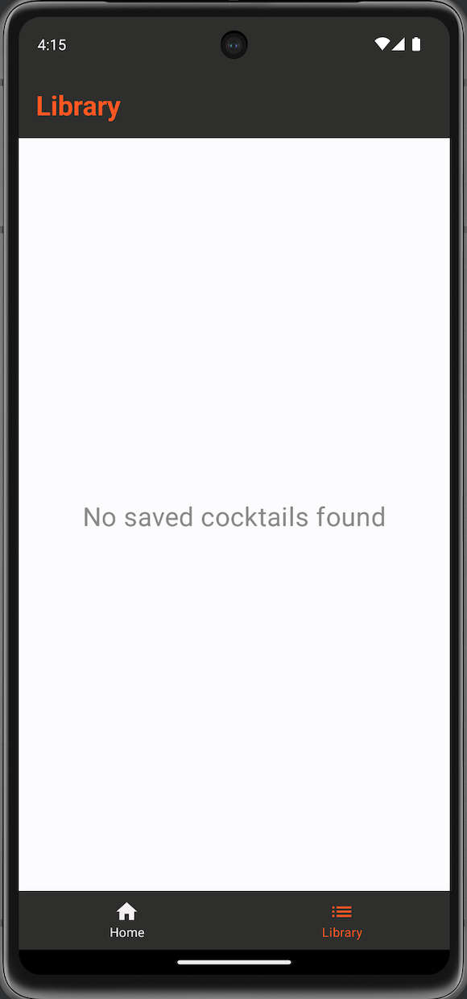

# World of Cocktails

This application gets data from a remote source -  Cocktail API and shows these items as a list in the app with pagination. You can also search for a cocktail by its name.
It is possible to save/remove a cocktail and view detailed information about it.

## Technology Stack

- **Programming Language**: [Kotlin](https://kotlinlang.org/)
- **Architecture Pattern**: MVVM (Model-View-ViewModel)
- **Dependency Injection**: [Hilt](https://developer.android.com/training/dependency-injection/hilt-android)
- **Asynchronous Programming**: [Kotlin Flow](https://kotlinlang.org/docs/flow.html), [Coroutines](https://kotlinlang.org/docs/coroutines-overview.html)
- **Database**: [SQLite](https://www.sqlite.org/index.html) (with [Room](https://developer.android.com/training/data-storage/room))
- **Networking**: [Retrofit2](https://square.github.io/retrofit/)
- **Navigation**: [Navigation component](https://developer.android.com/develop/ui/compose/navigation)
- **View Layer**: [Jetpack Compose](https://developer.android.com/compose)
- **Image loading**: [Coil](https://coil-kt.github.io/coil/compose/)
- **Api responce**: [JSON](https://developer.mozilla.org/en-US/docs/Learn/JavaScript/Objects/JSON)
- **Pagination**: [Jetpack Paging 3](https://developer.android.com/topic/libraries/architecture/paging/v3-overview)

## Screenshots

### Loading

  
  

                                             |
### Home screen

|:-----------------------------------------:|:-------------------------------------------------:|:----------------------------------------------:|
|   |          |           |                                  
|   |  |       |
|     |       |                                                | 
|       |           | |      
